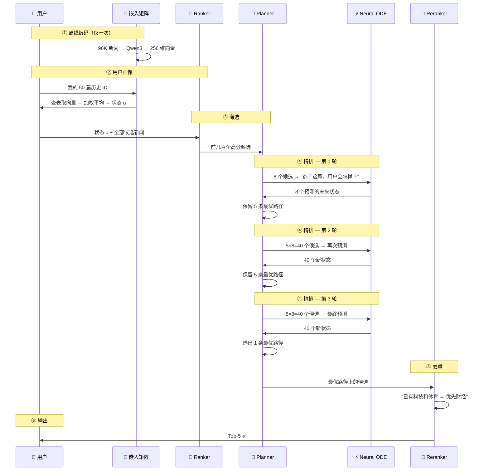

# Intent-Drift News Planner

> 基于 Neural ODE 的新闻推荐兴趣漂移建模系统

## 概述

传统推荐系统追求点击率最大化，容易导致"信息茧房"——用户反复看到同类内容。本项目提出 **Intent-Drift News Planner**，将推荐视为动态演化过程：不只预测用户下一秒想点什么，更预测推荐行为对用户兴趣状态的长期影响。

```
用户当前兴趣 u(t)  →  推荐新闻 a(t)  →  Neural ODE 预测漂移  →  未来兴趣 u(t+1)
```

通过多步前瞻搜索，在即时相关性和长期信息覆盖之间找到平衡——既命中偏好，又拓宽视野。

---

### Ranker 与 Planner：分工与协作

| 角色 | 组件 | 做什么 | 关心什么 |
|------|------|--------|----------|
| 📚 图书管理员 | **Ranker** | 快速筛出几百本"你可能会喜欢的" | 你和这本书有多匹配？（**当下**） |
| ✍️ 编辑 | **Planner** | 推演你的阅读轨迹，排出一份多元书单 | 读了这本之后你会变成什么样？（**未来**） |

> 编辑用 Neural ODE（兴趣预测引擎）向前模拟几步——像下棋一样推演你的阅读轨迹。最终选出的 5 本书里，既有你确定会喜欢的，也有你没想到但读了会拓宽视野的。

这就是 Coverage@5 从 **66% → 96%** 的含义：管理员单打独斗时，Top-5 覆盖了约三分之二的兴趣领域。编辑加入后，几乎每份书单都兼顾多个方向——且命中率保持在 44.5%。

---

## 系统架构

```mermaid
flowchart TD
    subgraph 离线阶段["🔧 离线预处理（仅一次）"]
        RAW["📄 behaviors.tsv<br/>用户行为日志"] --> QWEN["🧬 Qwen3-Embedding<br/>frozen · 256 维输出<br/>将每篇新闻编码为语义向量"]
        QWEN --> NPZ["💾 嵌入矩阵 .npz<br/>96K 新闻 × 256 维"]
    end

    NPZ --> USER["👤 用户画像构建<br/>最近 50 条历史 → 加权平均<br/>→ 用户兴趣状态向量 u"]
    
    USER --> RANKER["🎯 GRU Ranker<br/>hidden=256 · 序列建模<br/>对全部候选新闻打分排序<br/>输出：前几百个高分候选"]
    
    RANKER --> PLANNER

    subgraph PLANNER["🧠 Planner — 多步前瞻规划"]
        direction TB
        BS["🔍 Beam Search<br/>5 条路径并行 · horizon=3<br/>每步展开 8 个候选分支"] 
        BS -->|"每条候选"| ODE
        ODE["⚡ Neural ODE 世界模型<br/>MLP(512) · ReLU · RK4<br/>du/dt = MLP(u, a)<br/>预测阅读后的兴趣漂移"]
        ODE -->|"预测的未来状态"| BS
        BS --> COV["🎨 Coverage Reranker<br/>贪心类别去重<br/>'已有体育？优先选科技'"]
    end

    COV --> TOP5["✅ Top-5 推荐<br/>Coverage 66% → 96%<br/>既命中偏好 · 又荤素搭配"]

    style PLANNER fill:#1a1a2e,stroke:#e94560,stroke-width:2px
    style ODE fill:#16213e,stroke:#0f3460,stroke-width:2px
    style BS fill:#16213e,stroke:#0f3460
    style COV fill:#16213e,stroke:#0f3460
    style RANKER fill:#1a1c1e,stroke:#c7512e
    style TOP5 fill:#1a1c1e,stroke:#c7512e,stroke-width:3px
```



| 组件 | 职责 | 比喻 |
|------|------|------|
| Ranker | 海量候选中**筛选** | 图书管理员 |
| Neural ODE | 预测**状态变化** | 兴趣预测引擎 |
| Beam Search + Coverage | 多步**前瞻** + 类别**去重** | 编辑排版 |

---

### 一次推荐请求的完整旅程



| 参数 | 值 | 含义 |
|------|-----|------|
| beam_width | 5 | 每轮保留的并行路径数 |
| branching_factor | 8 | 每条路径每轮展开的候选数 |
| horizon | 3 | 前瞻轮数 |
| ODE 调用次数 | ~88 次 | 第1轮 1×8 + 第2轮 5×8 + 第3轮 5×8 |
| 最终输出 | Top-5 | 5 篇推荐 |

---

## 数据集

MIND 新闻推荐数据集（PaddleRec 镜像），约 96,000 篇新闻，百万级用户行为日志。

| | 训练集 | 验证集 |
|------|------|------|
| 原始 behavior 数 | 1,286,316 | 192,476 |
| Ranker 样本 | 950 万（全量） | 750 万（全量） |
| World Model 样本 | 31 万（3 步多步） | 4.7 万（3 步多步） |
| 负采样 | 每条正例最多 4 条负例 | 保留全部负例 |
| 存储 | JSONL（ID）+ .npz（72MB 嵌入矩阵） | 同左 |

> 验证集评估默认使用 **2,000 impressions 随机采样**（`MAX_DEV_IMPRESSIONS=2000`），平衡速度与稳定性。设为 `0` 可评估全量 192K impressions。

详见 [`DATA.md`](DATA.md)。

---

## 实验结果

以下结果基于 **2,000 impressions 随机采样**（`MAX_DEV_IMPRESSIONS=2000`），全量训练数据。World Model 采用 **Drift-Aware 训练**（联合优化 MSE + 漂移 MSE + 漂移 Cosine）。

### Ranker 与 Planner

| 指标 | Ranker-only | + Planner | 变化 |
|------|:---------:|:--------:|:----:|
| Accuracy | 94.48% | — | — |
| AUC | 0.701 | — | — |
| Recall@5 | 50.75% | — | — |
| **Coverage@5** | **66.53%** | **96.40%** | ↑ **30pp** |
| ILS@5（越低越多样） | 0.579 | 0.527 | ↓ 9% |
| HitRate@5 | — | **44.82%** | — |

### Neural ODE World Model — 三方对比

| 指标 | 恒等映射 | Neural ODE（Drift-Aware） |
|------|:--:|:--:|
| State Cosine | 0.9857 | 0.9927 |
| State MSE | 7.5×10⁻⁵ | 3.7×10⁻⁵ |

| 漂移指标 | Step 1 | Step 2 | Step 3 |
|------|:--:|:--:|:--:|
| **Drift Cosine** | **0.5734** | **0.8042** | **0.9789** |
| Drift MSE | 6.3×10⁻⁵ | 5.0×10⁻⁵ | 3.7×10⁻⁵ |

> 恒等映射（预测"兴趣不变"）的 State Cosine 为 0.9857。Drift-Aware Neural ODE 超越此基线（0.9927），同时**漂移余弦从 0.57 递增至 0.98**——表明模型在信号累积中逐步锁定了正确的兴趣漂移方向。单步漂移余弦 0.57 也反映了单次点击对用户兴趣状态的弱信号特性。

---

## 快速开始

```bash
pip install -e '.[train]'

# 数据预处理（N_STEPS=3 生成多步世界模型数据）
make data N_STEPS=3

# 训练（Ranker + Neural ODE 世界模型）
make train N_STEPS=3

# ── 评测（4 种独立模式）──

# 完整管线：Ranker + World Model + Planner
make eval-all MAX_DEV_IMPRESSIONS=2000

# 仅 Ranker：分类指标 + Top-K 意图覆盖
make eval-ranker MAX_DEV_IMPRESSIONS=2000

# 仅 World Model 单步预测：state → 1 click
make eval-wm

# 仅 World Model 多步预测：state → N clicks（误差累积）
make eval-wm-multi WORLD_MODEL_N_STEPS=3

# 仅 Planner：Beam Search + Coverage Reranker
make eval-planner MAX_DEV_IMPRESSIONS=2000
```

> `MAX_DEV_IMPRESSIONS=0` 使用全量验证集（192K impressions），设为 `5000` 使用 5K 采样以加速评估。

**环境**：Python ≥ 3.11 · PyTorch ≥ 2.3 · Qwen3-Embedding-0.6B · NVIDIA RTX 5090

---

## 项目结构

```
.
├── configs/default.json        训练配置
├── Makefile                    构建入口（data / train / eval）
├── pyproject.toml              依赖管理
├── README.md
├── DATA.md                     数据集详细说明
│
├── data/                       （用户自行下载 MIND 数据集）
│   ├── raw/mind/               MIND 原始 TSV（PaddleRec 镜像）
│   └── processed/              Qwen3 编码产物（make data 自动生成）
│
├── artifacts/                  （make train 自动生成）
│
├── scripts/
│   ├── prepare_mind.py         数据预处理
│   ├── train_ranker.py         Ranker 训练
│   ├── train_world_model.py    世界模型训练（Neural ODE，多步）
│   └── eval.py                 评测（4 模式 + 恒等基线 + 漂移指标）
│
├── src/agentic_rec/
│   ├── data/                   数据加载
│   ├── trainers/               Ranker & 世界模型训练
│   ├── world_model/            Neural ODE（Drift-Aware Loss）
│   ├── planner/                Beam Search + Coverage Reranker
│   ├── eval/                   评测指标
│   └── export.py               checkpoint 导出
│
└── tests/                      单元测试
```

---

## 参考文献

1. Wu et al. *MIND: A Large-scale Dataset for News Recommendation.* ACL 2020.
2. Zhang et al. *Qwen3 Embedding: Advancing Text Embedding and Reranking Through Foundation Models.* arXiv:2506.05176, 2025.
3. Lin et al. *Towards Interest Drift-driven User Representation Learning in Sequential Recommendation.* SIGIR 2025.
4. Wang et al. *Beyond Item Dissimilarities: Diversifying by Intent in Recommender Systems.* KDD 2025.
